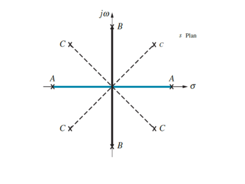

# Routh-Hurwitz
The Routh-Hurwitz criterion is used to test the stability of a system without finding the poles themselves, making it very useful for systems with parameters whose value may vary, since it can give you the interval where this parameter can shift without going into instability. 

This code takes as input a array of polynomial coefficients (from a transfer function’s denominator) and displays the Routh-Hurwitz table (and a message regarding the stability of said system)

NOTE: As of now, symbolic entry is not available. 

## Necessary but not sufficient conditions for Stability
Those are the very first conditions the algorithm evaluates, not passing them guarantees the system is unstable. They are:

* All coefficients of the polynomial must have the same sign
* No missing term in the coefficients

## Special Cases
There are four special cases when calculating the Routh-Hurwitz table, in each of them you will receive a customized message informing you that they happened.

### 1. A zero followed by a non zero element in same line
Unlike the others, it doesn’t indicate any lack of stability, but it may throw some values of the table to infinity (but since we are only interested in the sign of the elements and not in their value, it hardly matters)

### 2. Entire row of zeros
This means that you have a pair of symmetrical poles in your system, causing it to be either marginally stable (case B) or unstable (case A).

The 3 possibilities of how symmetrical poles can placed are shown in the image below:

Also, since we're discussing only a pair of poles, case C is not possible in this scenario (it belongs to the next case).

### 3. Two entire rows of zeros
This means that you have 2 pairs of symmetric poles in your system (a case C in the previous image, or 2 cases A, or a case A along with a case B etc).

However, unlike the previous case, here,  your system is always unstable.

### 4. Entire LAST row is filled with zeros
This is an extra special case, and it means that you have a pole on the origin of the system, making it marginally stable.
